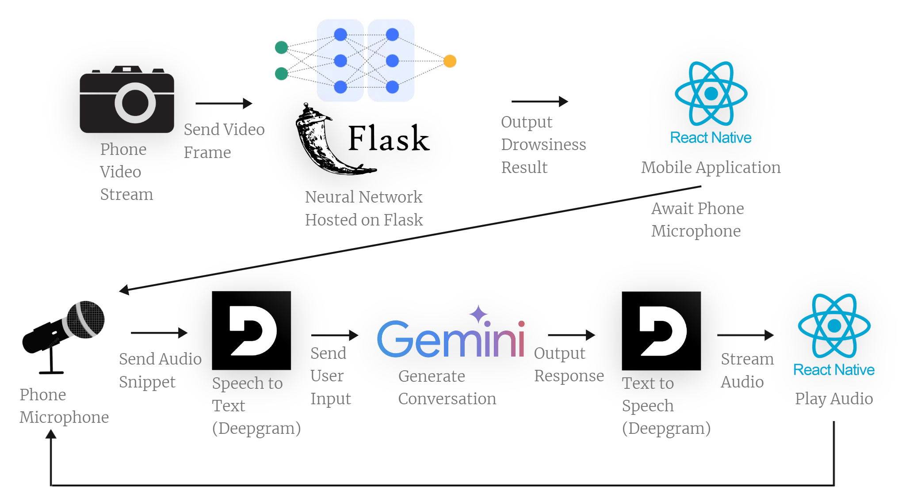

# DROWSY GUARD
DrowsyGuard is in the **Software Development Root > AI Branch > Social Impact Leaf**

## Inspiration

The road is truly a dangerous place. Constant vigilance is needed to safely get to from point A to point B, and drivers need to be awake, alert, and aware of the situation around them at all times. In a nation that runs on the wheels of motor vehicles, with daily commutes to work via car and cross-state treks to haul freight in trucks, having a vigilant companion to watch your back while driving becomes more essential than ever.

Although there are countless factors that contribute to motor vehicle accidents on the road, an underlying issue that often goes unaddressed, and is in fact often normalized in our society, is lack of sleep. According to the [National Sleep Foundation](https://www.thensf.org/wp-content/uploads/2022/11/National-Sleep-Foundation-Breaking-Report_Drowsy-Driving.pdf), 20% of all motor vehicle accidents stem from drowsiness.

We wanted to build a co-pilot for drivers that anyone, whether it's a mother driving to the local grocery store or a truck driver driving thousands of miles several states over, could use while getting to their destination safely. No matter the vehicle, income, or background, DrowsyGuard aims to protect.

## Data Equity

The dataset that we chose included photos from a wide range of demographic groups.

We understand that AI can have inherent biases based on the data it is trained on. Resume analyzers sometimes give lower scores to feminine or names from minorities, for example. That is why we conscientiously searched for a dataset that featured many different people to enable our model to work effectively across different groups of people.

## Description

DrowsyGuard is a phone application that monitors a driver's alertness. If the application determines that the driver is sleep, they will alert the driver and attempt to talk to them to convince them to pull over and take a break. If the driver continues, DrowsyGuard will converse and engage with the driver to keep them alert and awake until they are able to take a break. The driver will be able to talk to DrowsyGuard as if they had someone sitting in their passenger seat.

When we designed DrowsyGuard, we thought of an escalation policy for DrowsyGuard to take more actions over time.

If drowsiness is detected, DrowsyGuard will engage in conversation
If a user does not respond, DrowsyGuard will urge the user to pull over
After more time, we want DrowsyGuard to call or text an emergency contact
If after all that, there is no response, we would like DrowsyGuard to contact emergency services
How we built it

## Architecture

DrowsyGuard was built with two models to assess a driver's alertness. Using a [dataset](https://www.kaggle.com/datasets/ismailnasri20/driver-drowsiness-dataset-ddd) of driver drowsiness images on Kaggle, we implemented two models, both with 99% accuracy.

Initially, we utilized a Vision Transformer model (ViT) that was fine-tuned with the dataset. Later on, we felt that a Neural Network trained on the data would be better for real-time video streaming. We hosted these models in a Python Flask backend.

The mobile interface was designed with Figma and built on React Native, TypeScript. and Expo.

Microphone data from the phone is streamed to the backend in chunks, which are then sent to Deepgram to transcribe the audio, create a response, and send it back to the phone app to give DrowsyGuard its conversational abilities. We then switch to AssemblyAI to transcribing due to technical issues.

To tie everything together we utilized Websockets for real-time low-latency communication between the phone application and the AI models.

## Challenges we ran into

Voice Activity Detection proved a bit challenging, especially with how states work and the lack of great Microphone/Audio Streaming libraries compatible with React Native and Expo. Microphone data could not be streamed using the built-in callback function, as the actual audio chunk data was not exposed, only audio loudness. As a creative work-around, we found that we had to rely on long pauses in speech to record and save conversation snippets, which were added to a queue and broadcasted to the AI models in the backend.

A big issue we ran into was that we could not utilize asynchronous programming in our Flask Websocket server backend to transcribe the streamed audio from the phone application to Deepgram. While all of our pieces ultimately worked separately, we were unable to integrate the natural, conversational ability that we wanted to have. Instead, to finish DrowsyGuard, we opted to implement a standard text chat interface instead and leave this problem for the future of DrowsyGuard. We opted to do the speech to text in the frontend using AssemblyAI

Even though our training boasted high accuracy, we still encountered a few issues with accuracy. As Vishal put it, "I kinda understand why this feature in cars are not really advertised now after building this." With more data and images, the accuracy can continue to be refined and improved.

Lastly, time management was difficult, as much of the team juggled working on this hackathon with full-time work, upcoming interviews, and even cross-state moves. However, we managed to accomplish a lot despite those challenges.

## Accomplishments that we're proud of

We really are proud of this solution that we came up with, as we feel that it can have a noticeable impact and solves an important social issue. While we know that some cars already have similar solutions to DrowsyGuard, most of them are implemented in **higher-end and luxurious cars**. For many, these cars are much **out of reach** and oftentimes, **these are the people who are forced to drive drowsy out of necessity, not negligence**. DrowsyGuard is accessible to anyone with an internet connection and a phone with a camera. Irrespective of the vehicle someone is in, **anyone can benefit** from having DrowsyGuard as their driving companion.

In terms of the accuracy, we were very satisfied with how our model performed. We had over 99% accuracy.

We're also proud of our teamwork. While Stephanie and Vishal have worked with each other before, Dylan and Akiko (Amarjargal) were new additions. We all worked together very well though!

## Team Members

Dylan:

- Experienced in Full-Stack Web Development and Mobile Development
- Experienced in Architecture Planning and Ideation

Stephanie:

- Experienced Building Full-Stack and AI Applications
- Experienced in Ideation and Project Planning
- Experienced in Implementing Frontend & Design

Vishal:

- Experienced in Building Full-Stack Web and Mobile Applications
- Experienced in Training and Fine-Tuning AI models
- Experienced in Leveraging GenAI in building Apps.

Akiko (Amarjargal):

- Experienced in Building Full-Stack Web and Mobile Applications
- Experienced in Implementing Frontend Design

## What's next for DrowsyGuard

- Full integration with Deepgram for Voice conversation
- Finer-tuning of alertness to estimate drowsiness levels rather than a binary "drowsy" or "not" to better inform DrowsyGuard when to escalate
- Ability for Deepgram to orchestrate and escalate intervention policies
    - We imagine the ability to: look up and recommend a nearby rest area, sending a text or opening a call to a loved one or supervisor/coworker, and even calling and connecting the driver to emergency services.
- Train the model with even more images
## Built With

assemblyai
deepgram
expo.io
figma
flask
kaggle
neural-net
python
react-native
typescript
vision-transformer-model
websockets